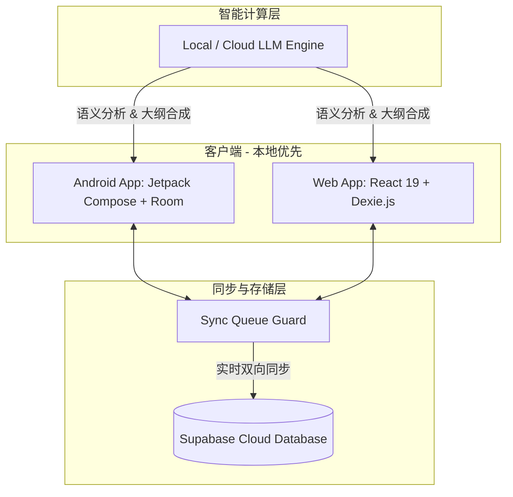

# 🌲 Glean Read — 智能摘录阅读与 Local-First 知识管理系统

<p align="center">
  <b>简体中文</b> | <a href="./README_EN.md">English</a>
</p>

<p align="center">
  
  
  
  
</p>

---

**Glean Read** 是一款专为高效深度阅读者打造的**本地优先（Local-First）双端智能摘录与知识沉淀系统**。

我们致力于解决信息碎片化时代的“收藏不看”与“看完即忘”痛点。通过**移动端（Android）**与**网页端（Web）**的协同，Glean Read 让您能够随时随地捕捉灵感、沉淀高亮；并借助**大语言模型（LLM）**的智能合成能力，自动将零散的摘录内容梳理为结构化的**「智能知识树」**，实现从“碎片信息”到“系统知识体系”的无缝飞跃。

---

## 🎨 界面预览

本系统严格遵循现代 UI 设计美学，移动端深度适配 **Material Design 3 (M3) / Material You** 动态色彩体系，网页端则采用**毛玻璃（Glassmorphism）**与丝滑微动效，打造极具品质感的视觉与交互体验。

### 📱 移动端 (Android App)

|  |  |  |
| :---: | :---: | :---: |
| 📖 **卡片式摘录流** | 🌳 **AI 智能知识树** | ⚡ **全局快速摘录** |
| 沉浸式阅读与精美高亮卡片 | AI 自动归纳与层级树状化整理 | 全局悬浮窗/分享链一键归档 |

|  |  |
| :---: | :---: |
| 🏷️ **灵活标签系统** | ⚙️ **多维配置中心** |
| 标签收件箱与多对多关联筛选 | 深色模式与云同步、AI 密钥管理 |

### 💻 网页端 (Web Application)


*Web 端主页面：适配大屏阅读，提供可视化的知识树拓扑图，支持拖拽整理与高度自定义的富文本卡片阅读。*

---

## ✨ 核心特性

- 📥 **无感化快速摘录 (Quick Capture)**
  - 支持应用内/全局小部件（Widget）以及系统分享链快速捕捉。
  - 您可以在浏览器或者微信公众号，复制一段文字，然后通过系统分享功能分享到APP，拉起摘录弹窗，将内容快速摘录到 GleanRead 中，不打断当前的阅读流程。
  - 智能解析 URL，自动提取网页元数据、正文内容并智能填充摘录上下文。
- 🌳 **AI 辅助智能知识树 (AI Synthesis Tree)**
  - 运用 LLM 对无序摘录进行多维度语义建模，一键将碎片化高亮聚合成系统化的知识大纲。
  - 内置节点拖拽重组（Reorder）、关系图谱（Relationship Graph）及层级浏览，支持深度编辑与树节点归档。
- ⚡ **本地优先架构 (Local-First Architecture)**
  - 双端皆具备完备的本地离线数据库，所有读取与写入操作均在本地即时响应，无网络延迟。
  - Web 端基于 `Dexie.js (IndexedDB)`，Android 端基于 `Room`。
- 🔄 **强健的云同步与多端协同 (Supabase Cloud Sync)**
  - 基于 Supabase 提供多用户安全认证与实时云同步。
  - 内置同步队列保护（Sync Queue Guard），确保网络环境波动时数据的绝对一致，冲突自动解决。
- 🎨 **极致美学设计 (Harmonious Design Aesthetics)**
  - **Android**: 100% 声明式 Jetpack Compose 架构，全面接入 Material 3 与 Material You 动态主题，搭载微交互动效与流畅的手势转场。
  - **Web**: 响应式毛玻璃布局，结合 React Flow 实现动态物理引擎驱动的知识拓扑网络。

---

## 🛠️ 技术栈与架构

Glean Read 采用清晰的模块化多端架构，保障高性能、离线可用以及灵活的扩展性：



### 📱 Android 移动端
- **核心语言**: Kotlin (100% 现代语法)
- **UI 框架**: Jetpack Compose (遵循声明式组件与单向数据流 UDF)
- **设计体系**: Material Design 3 / Material You
- **本地存储**: SQLite / Room Database
- **异步与流**: Kotlin Coroutines & Flow (实现全异步响应式数据流)
- **编译环境**: JDK 21

### 💻 Web 网页端
- **核心框架**: React 19 + TypeScript + Vite
- **样式方案**: TailwindCSS + PostCSS (提供高度灵活的组件原子样式)
- **本地存储**: Dexie.js (优雅的 IndexedDB 响应式封装)
- **状态管理**: Zustand (轻量级全局状态) & TanStack Query v5 (服务端状态同步)
- **编辑器**: Tiptap Rich Text Editor (高度可定制的现代化编辑器)
- **关系图谱**: React Flow (交互式节点拓扑渲染) & Dagre (自动树状布局算法)

### ☁️ 后端与云服务
- **基础设施**: Supabase (基于 PostgreSQL)
- **功能依赖**: Row-Level Security (RLS) 安全策略、Realtime 实时订阅、GoTrue Auth 用户系统。

---

## 📁 项目目录结构

```text
glean-read/
├── glean-read-android/    # Android 客户端 (Jetpack Compose 模块)
│   ├── app/               # 安卓主应用模块
│   └── gradle/            # Gradle 依赖配置
├── glean-read-web/        # Web 网页端 (React 19 + Vite 模块)
│   ├── src/               # 前端核心源码 (包含 components, hooks, db 等)
│   └── tests/             # Playwright 端到端测试与单元测试
├── supabase/              # Supabase 后端配置与数据库 Migrations
├── docs/                  # 系统架构与开发指南文档
└── img/                   # 系统设计图与预览截图
```

---

## 🚀 快速开始

### 1. 配置 Supabase 后端
在 Supabase 平台创建新项目，并执行 `supabase/` 目录中的迁移脚本初始化表结构。
在 `glean-read-web/` 与 `glean-read-android/` 中配置您的 Supabase Credentials：
- 拷贝 Web 端的环境配置文件：
  ```bash
  cd glean-read-web
  cp .env.example .env # 填入 VITE_SUPABASE_URL 与 VITE_SUPABASE_ANON_KEY
  ```

### 2. 启动 Web 网页端
进入 `glean-read-web` 目录，安装依赖并运行本地开发服务器：
```bash
cd glean-read-web
npm install
npm run dev
```
打开浏览器访问 `http://localhost:5173`。

### 3. 构建与运行 Android 移动端
> **⚠️ 编译要求**：根据项目基线要求，Java Home 必须使用 **JDK 21**。

设置环境变量：
```powershell
# Windows PowerShell
$env:JAVA_HOME="E:\program\jdk21"
```
使用 Android Studio 打开 `glean-read-android` 文件夹。等待 Gradle Sync 完成后，直接运行 `app` 模块到模拟器或真机。

---

## 🤝 编码规范与提交指南

为了保持代码库的健康与协作的高效，本项目严格遵循以下规范：

1. **Android 规范**
   - 必须使用 `androidx.compose.material3` 的组件与主题，禁止使用旧版 Material 组件。
   - 避免使用全限定类名，所有类均需通过 `import` 导入后再行使用。
   - UI 部分应优先适配动态色彩与暗色模式。
2. **Git 提交信息规范 (Conventional Commits)**
   所有的提交日志必须符合以下格式：
   ```text
   <type>(<scope>): <description>
   
   [body - 详细修改说明]
   ```
   - **`type` 可选值**：`feat` (新功能), `fix` (修 bug), `docs` (文档更新), `style` (格式/样式), `refactor` (重构), `test` (测试), `chore` (构建/工具链)。

---

*Glean Read 让每一次阅读，都留下智慧的痕迹。*
