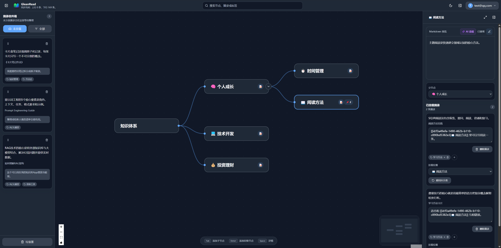
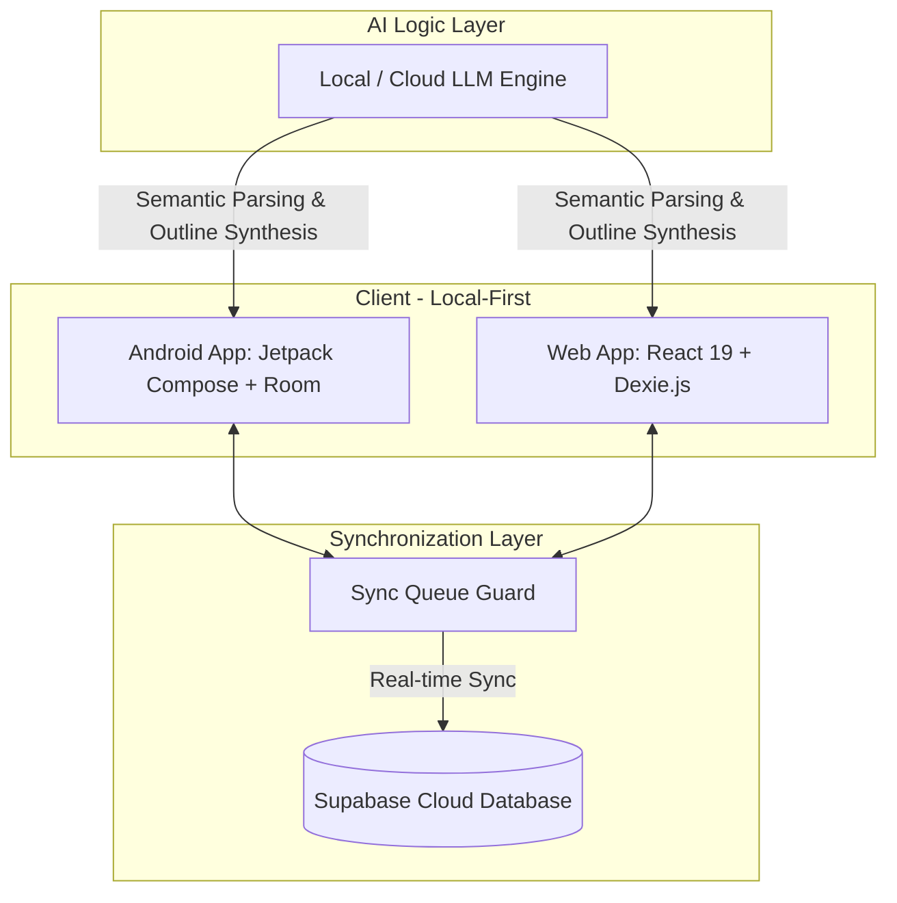

# 🌲 Glean Read — Intelligent Reading Excerpts & Local-First Knowledge Management System

<p align="center">
  <a href="./README.md">简体中文</a> | <b>English</b>
</p>

<p align="center">
  
  
  
  
</p>

---

**Glean Read** is a **local-first, cross-platform intelligent reading excerpt and knowledge crystallization system** designed for highly efficient, deep readers.

We aim to solve the pain points of "collecting but never reading" and "reading but instantly forgetting" in the era of information fragmentation. In scenarios like standing in lines, taking the subway, or waiting for coffee, we constantly read technical articles on our phones, yet most knowledge briefly passes through our minds and is soon forgotten. To address this exact pain point, Glean Read establishes an elegant workflow of **"Seamless Excerpting on the Go, Systematic Organizing on Web"**:
- **Mobile Side (Android)**: When reading on a browser or WeChat, simply select a paragraph of text, tap "Share to App", and a lightweight dialog will pop up. You can write down your instant thoughts and save it to Inbox **without interrupting your reading flow**, while the app **automatically captures the article's URL and title**.
- **Web Side (Web)**: When you have dedicated blocks of free time, open the Web workspace on a desktop. You can easily drag and drop the scattered excerpts in your Inbox to **organize them onto a visual horizontal knowledge tree (mind map)**. Combined with an outline composer and **Large Language Models (LLMs)** for auto-synthesis, it seamlessly structures raw highlights into a cohesive, long-term personal knowledge base.


---

## 🎨 UI Preview

This system strictly adheres to modern UI design aesthetics. The mobile app deeply integrates the **Material Design 3 (M3) / Material You** dynamic color system, while the web application adopts a responsive **Glassmorphism** layout with smooth micro-interactions to deliver a premium user experience.

### 📱 Mobile Client (Android App)

|  |  |  |
| :---: | :---: | :---: |
| 📖 **Card-Style Excerpt Stream** | 🌳 **AI-Driven Knowledge Tree** | ⚡ **Global Quick Capture** |
| Immersive reading with exquisite highlight cards | AI-powered synthesis & hierarchical organization | Global float window/share sheet one-click capture |

|  |  |
| :---: | :---: |
| 🏷️ **Flexible Tagging System** | ⚙️ **Multi-Dimensional Settings** |
| Tag inbox with multi-to-multi dynamic filtering | Dark mode toggle, cloud sync & AI key configs |

### 💻 Web Client (Web Application)


*Web Main Workspace: Optimized for large-screen reading, showcasing an interactive topology view of your knowledge network with smooth drag-and-drop actions.*

---

## ✨ Key Features

- 📥 **Seamless Quick Capture**
  - Capture excerpts instantly using the system-wide share sheet or global app widgets.
  - You can copy a piece of text in the browser or WeChat official account, and then share it to the APP through the system sharing function, which will pop up the excerpt dialog and quickly extract the content to GleanRead, without interrupting the current reading process.
  - Automatically parse URLs to fetch metadata, main body text, and auto-populate context.
- 🌳 **AI-Powered Intelligent Knowledge Tree**
  - Leverage LLMs to model semantic relations of raw excerpts and assemble them into a structured outline.
  - Interactive nodes supporting drag-and-drop reorganization, relationship graphs, and sub-tree archiving.
- ⚡ **Local-First Architecture**
  - Complete local databases in both clients ensure immediate responsiveness for all reads and writes with zero network latency.
  - Powered by `Dexie.js (IndexedDB)` on Web and `Room` on Android.
- 🔄 **Robust Cloud Sync (Supabase Sync)**
  - Multi-user authentication and real-time cloud backup provided by Supabase.
  - Built-in **Sync Queue Guard** ensures data consistency even under fluctuating network conditions, with automatic conflict resolution.
- 🎨 **Premium Design Aesthetics**
  - **Android**: 100% declarative UI with Jetpack Compose, dynamic Material You color matching, and fluid gesture-based animations.
  - **Web**: Stunning glassmorphism design paired with React Flow for physically simulated, dynamic node topologies.

---

## 🛠️ Architecture & Tech Stack

Glean Read utilizes a clean, decoupled multi-platform architecture to guarantee offline availability and high scalability:



### 📱 Android Client
- **Programming Language**: Kotlin (100% modern syntax)
- **UI Framework**: Jetpack Compose (Declarative UI with Unidirectional Data Flow - UDF)
- **Design System**: Material Design 3 / Material You
- **Local Database**: SQLite / Room Database
- **Asynchronous Flow**: Kotlin Coroutines & Flow (for reactive, async data streams)
- **Build Environment**: JDK 21

### 💻 Web Client
- **Core Framework**: React 19 + TypeScript + Vite
- **Styling Solution**: TailwindCSS + PostCSS (Highly flexible utility-first classes)
- **Local Storage**: Dexie.js (IndexedDB wrapper with live query capabilities)
- **State Management**: Zustand (Global state) & TanStack Query v5 (Server state synchronization)
- **Editor**: Tiptap Rich Text Editor (Modern, block-based extensible rich text)
- **Topology Network**: React Flow (Interactive node visualization) & Dagre (Hierarchical layout engine)

### ☁️ Backend & Cloud Services
- **Infrastructure**: Supabase (PostgreSQL engine)
- **Security & Sync**: Row-Level Security (RLS) policies, Realtime DB subscriptions, and GoTrue OAuth authentication.

---

## 📁 Project Directory Structure

```text
glean-read/
├── glean-read-android/    # Android client codebase (Jetpack Compose module)
│   ├── app/               # Main application module
│   └── gradle/            # Gradle dependency configurations
├── glean-read-web/        # Web client codebase (React 19 + Vite module)
│   ├── src/               # Front-end source code (components, hooks, db, etc.)
│   └── tests/             # Playwright E2E and unit test suites
├── supabase/              # Supabase DB schema migrations and cloud configs
├── docs/                  # System design blueprints & development specifications
└── img/                   # System UI screenshots and mockups
```

---

## 🚀 Quick Start

### 1. Setup Supabase Backend
Create a new project in the Supabase Dashboard, and execute the migration scripts inside `supabase/` to initialize tables.
Configure your Supabase Credentials in both `glean-read-web/` and `glean-read-android/`:
- Copy the Web environment configuration template:
  ```bash
  cd glean-read-web
  cp .env.example .env # Fill in VITE_SUPABASE_URL and VITE_SUPABASE_ANON_KEY
  ```

### 2. Launch Web Client
Navigate to the `glean-read-web` directory, install dependencies, and spin up the Vite development server:
```bash
cd glean-read-web
npm install
npm run dev
```
Open your browser and navigate to `http://localhost:5173`.

### 3. Run Android Client
> **⚠️ Critical Build Prerequisite**: Your local Java Home must point to **JDK 21** as defined by project guidelines.

Set up the required environment variable:
```powershell
# Windows PowerShell
$env:JAVA_HOME="E:\program\jdk21"
```
Open the `glean-read-android` folder using Android Studio. Wait for the Gradle Sync to complete, then deploy the `app` module to an emulator or physical device.

---

## 🤝 Coding Standards & Git Commit Rules

To keep the codebase maintainable and collaborative:

1. **Android Development**
   - Use components and themes strictly from `androidx.compose.material3`. Obsolete Material components are prohibited.
   - Do NOT use fully qualified names for classes; import them explicitly.
   - Adapt layouts for both light/dark modes and Dynamic Colors where applicable.
2. **Git Commit Message Rules (Conventional Commits)**
   All commit messages must comply with the following structure:
   ```text
   <type>(<scope>): <description>
   
   [body - detailed changes]
   ```
   - **`type` options**: `feat` (New feature), `fix` (Bug fix), `docs` (Documentation changes), `style` (Formatting/UI), `refactor` (Refactoring), `test` (Adding tests), `chore` (Build system).

---

*Glean Read — crystallizing every bit of reading into lasting wisdom.*
