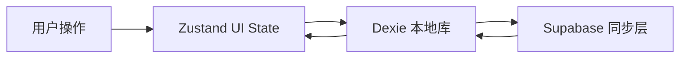

## 上下文

`glean-read-web` 目前还没有实现代码，这次变更是一次新的 Web 端工作台落地。产品设计已经明确了四个路由、三栏主工作台、知识树画布、收件箱拖拽挂载、右侧沉淀抽屉、全局搜索、独立认证页和本地优先同步链路；本设计只负责把这些能力收敛成可实现的架构，不提前进入具体任务拆分。

本次 Web 端与上一级 Android 仓库是完全分开的 OpenSpec 线，不共享 UI 组件或导航实现。

## 目标 / 非目标

**目标：**
- 建立 `/`、`/login`、`/auth/callback`、`/app` 的独立路由壳与认证守卫。
- 以三栏式工作台承载收件箱、知识树画布和详情抽屉。
- 用 Zustand 承接高频 UI 状态，用 Dexie 承接本地持久层，用 Supabase 承接云端同步。
- 让知识树、摘录、标签和挂载关系都能在本地先响应，再异步收敛到云端。
- 把编辑、挂载、搜索、主题和页面恢复都做成可恢复的本地状态，而不是一次性会话态。

**非目标：**
- 不在本次设计中实现服务端 schema 迁移或后台管理页面。
- 不引入全文检索引擎或 AI 生成引擎。
- 不把 landing page 做成完整营销站，只保留产品入口与基础介绍。
- 不在首版支持头像上传、裁剪或复杂协作编辑。

## 决策

### 1. 采用 React + Vite + TypeScript + Tailwind CSS 作为 Web 基座

选择原因：
- 这套栈适合快速搭建有大量局部交互的工作台页面。
- Tailwind 配合 CSS Variables 便于做 light / dark 主题切换和细粒度布局控制。
- Vite 对路由壳、组件拆分和本地开发都足够轻。

备选方案：
- 纯 CSS Modules。可行，但主题变量和密集布局的维护成本更高。
- Next.js。可行，但当前工作台更偏单页应用，本次没有服务端渲染或文件路由刚需。

### 2. 采用 `AppShell` + 路由守卫承载全局导航

路由职责固定为：
- `/`：产品入口页
- `/login`：独立登录页
- `/auth/callback`：认证回调页
- `/app`：受保护的主工作台

实现方式：
- `AppShell` 负责顶部导航、侧栏宽度、主题切换、全局搜索和账户入口。
- `AuthGate` 负责判断会话状态，未登录时把 `/app` 引导到登录流程。
- `AuthCallbackPage` 只负责接收认证结果、完成会话落盘和跳转，不承载业务内容。

备选方案：
- 把登录页和工作台放进同一个视图树。被放弃，因为会让认证状态和工作台状态耦合得太紧。

### 3. 采用 Zustand 作为高频 UI 状态中枢，Dexie 作为本地持久层

状态分层如下：



职责划分：
- Zustand：当前选中节点、左侧收件箱筛选、右侧抽屉开关、画布视口、搜索弹窗、主题模式、展开状态。
- Dexie：`knowledge_tree_node`、`excerpts`、`tags`、`excerpt_tags` 的本地镜像，以及视图偏好、同步游标和最近搜索等本地元数据。
- Supabase：最终云端数据源，负责会话、增量上传、增量拉取和实时通知。

选择原因：
- 画布拖拽、选中和侧栏切换需要 60fps 级别响应，不能直接绑远端数据。
- Dexie 适合离线、秒开和本地优先写入。

备选方案：
- 直接以 Supabase 为主数据源。被放弃，因为会破坏离线和秒开体验。

### 4. 知识树画布采用 React Flow + Dagre

实现方式：
- 画布使用 React Flow 负责节点、边、缩放和平移。
- 布局使用 Dagre 生成从左到右的树形排布。
- 节点渲染使用自定义 Node 组件，统一展示标题、笔记标记、摘录计数、折叠/展开和快捷操作。
- 初始视图仅展开第一层，展开状态只保存在本地。
- 同级顺序使用 `sort_order`，创建与插入使用稀疏排序，默认步长 `65536`。

选择原因：
- React Flow 对中间画布、节点高亮和视口控制很成熟。
- Dagre 足够处理左到右的 DAG 布局，不需要自己手写复杂坐标算法。

备选方案：
- 纯 Canvas / SVG 自绘。被放弃，因为维护成本高，快捷交互和节点菜单会更难做。

### 5. 收件箱、抽屉和画布共用同一份工作台快照

实现方式：
- 收件箱侧栏直接消费当前用户的本地摘录快照，只显示未挂载或全部摘录。
- 中间画布消费知识树节点快照，并负责目标节点高亮和挂载投放。
- 右侧抽屉以当前选中节点为上下文，顶部编辑 Markdown，底部展示该节点挂载的摘录流。
- 三个区域都从同一个 `WorkbenchSnapshot` 派生，避免各自重复计算节点归属和标签信息。

选择原因：
- 这样最容易保证“挂载后计数变化”“移回未分类”“右侧抽屉与中间画布同步”这几类交互不分裂。

### 6. 编辑器采用 Tiptap，并做 Markdown 读写适配

实现方式：
- 抽屉顶部的大纲编辑器使用 Tiptap 作为底层编辑引擎。
- 输出层序列化为 Markdown，输入层从 Markdown 反序列化。
- Slash 菜单、块级编辑和 `[[` 联想在页面内统一处理。
- 正文、想法和来源区使用统一的低强调输入风格，但编辑器能力按字段区分。

选择原因：
- Tiptap 对 React 友好，适合在抽屉这种局部区域嵌入。
- 需要 slash 菜单和自定义块时，Tiptap 的扩展模型更灵活。

备选方案：
- Milkdown。也可行，但首版在“页面内轻量编辑 + 自定义字段输入”上，Tiptap 更容易和其他 React 组件拼接。

### 7. 认证与回调采用 Supabase Session + 路由跳转

实现方式：
- 登录页支持邮箱密码、Magic Link 和 OAuth。
- 认证回调页只做会话接收、持久化和跳转，不渲染业务内容。
- 会话状态由 Supabase Client 统一维护，路由守卫依据当前 session 决定是否进入 `/app`。

选择原因：
- 认证链路越短，路由边界越清晰，出错后也更容易定位。

### 8. 同步引擎采用增量拉取 + 增量推送 + LWW 冲突策略

实现方式：
- 本地写入先进入 Dexie，再进入同步队列。
- 上传与拉取都围绕 `update_time`、`device_id`、`is_deleted` 做判断。
- `device_id` 存储在浏览器本地，避免自我回音重复刷新。
- 冲突阶段采用 Last-Write-Wins：`update_time` 新的覆盖旧的；时间无法可靠比较时以云端版本为准。
- 软删除始终保留，不做物理删除。

选择原因：
- 能覆盖单设备、离线、双端同时编辑和软删除这几个主要场景，同时不把首版同步做得过重。

备选方案：
- 手动字段级合并。被放弃，因为首版复杂度太高，也和当前需求不匹配。

### 9. 全局搜索与视图偏好都走本地持久化

实现方式：
- 搜索弹窗只基于本地快照和最近搜索构建结果集。
- 最近搜索、本地展开状态、面板宽度、选中节点、画布视口和主题模式都持久化到本地。
- 刷新后恢复的是“用户上次看到的工作台”，而不是每次都回到默认初始态。

选择原因：
- 这符合产品要求里的“可恢复上下文”和“本地优先”。

## 目录结构设计

Web 端采用“路由壳 + feature 分层 + shared 复用”的目录结构。所有业务代码都位于 `src/` 下，尽量避免跨 feature 直接互相引用；页面级状态和 UI 组件就近放在对应 feature 内，跨页面复用能力放入 `shared/`。

推荐结构如下：

```text
src/
├── app/
│   ├── App.tsx
│   ├── AppShell.tsx
│   ├── routes/
│   │   ├── AppRoute.tsx
│   │   ├── AuthCallbackRoute.tsx
│   │   ├── LoginRoute.tsx
│   │   └── HomeRoute.tsx
│   └── providers/
│       ├── AuthProvider.tsx
│       ├── QueryProvider.tsx
│       └── ThemeProvider.tsx
├── features/
│   ├── auth/
│   │   ├── components/
│   │   ├── hooks/
│   │   ├── pages/
│   │   └── authStore.ts
│   ├── workbench/
│   │   ├── components/
│   │   ├── store/
│   │   ├── types.ts
│   │   └── workbenchSelectors.ts
│   ├── knowledge-tree/
│   │   ├── components/
│   │   ├── graph/
│   │   ├── pages/
│   │   ├── store/
│   │   └── treeAdapters.ts
│   ├── inbox/
│   │   ├── components/
│   │   ├── pages/
│   │   └── inboxSelectors.ts
│   ├── detail-drawer/
│   │   ├── components/
│   │   ├── editor/
│   │   ├── pages/
│   │   └── detailSelectors.ts
│   └── sync/
│       ├── engine/
│       ├── queues/
│       └── syncSelectors.ts
├── shared/
│   ├── components/
│   ├── hooks/
│   ├── lib/
│   ├── styles/
│   ├── types/
│   └── utils/
├── db/
│   ├── dexie/
│   ├── repositories/
│   ├── mappers/
│   └── schema.ts
├── supabase/
│   ├── client.ts
│   ├── auth.ts
│   └── sync.ts
└── main.tsx
```

### 目录职责

- `app/`：承载应用级路由、Shell、Provider 和顶层布局。
- `features/auth/`：登录页、认证回调页和会话相关 UI。
- `features/workbench/`：三栏工作台的页面级状态、布局编排与通用 selector。
- `features/knowledge-tree/`：知识树画布、节点卡片、分支页和节点选择逻辑。
- `features/inbox/`：收件箱列表、过滤、拖拽源和卡片展示。
- `features/detail-drawer/`：右侧抽屉、Markdown 编辑器、摘录流和元信息编辑。
- `features/sync/`：本地队列、增量同步和冲突处理。
- `shared/`：全局复用组件、hooks、样式、工具函数和通用类型。
- `db/`：Dexie schema、本地 repository 和 DTO/Entity 映射。
- `supabase/`：Supabase client、认证封装和同步请求封装。

### 拆分原则

- 页面级状态只放在对应 feature 内，不把业务 state 统一堆到全局 `store/`。
- 可复用但和业务无关的 UI 组件放入 `shared/components`，例如按钮、弹层、空状态和通用布局容器。
- 数据访问统一走 `db/` 或 `supabase/`，页面组件不直接拼接 SQL 或 fetch 逻辑。
- 画布相关代码与普通表单代码分离，避免 React Flow 依赖污染其它 feature。
- 设计稿中明确独立的能力，后续也应保持独立目录，避免一个 feature 演变成“万能文件夹”。

### 首版目录映射

- `web-knowledge-workbench` 主要落在 `app/` 和 `features/workbench/`。
- `web-auth-shell` 主要落在 `features/auth/`。
- `web-knowledge-tree-graph` 主要落在 `features/knowledge-tree/`。
- `web-inbox-excerpts` 主要落在 `features/inbox/`。
- `web-detail-drawer` 主要落在 `features/detail-drawer/`。
- `web-local-first-sync` 主要落在 `features/sync/`、`db/` 和 `supabase/`。

## 风险 / 权衡

- React Flow、Tiptap、Dexie、Supabase 组合较多，初始集成成本高，但各自边界清晰，长期维护更稳。
- 本地搜索只做前端过滤，数据量极大时会有性能上限；首版先以当前工作台规模为边界。
- 视图状态如果没有按用户维度隔离，会把上一位登录者的展开状态带给下一位；因此所有本地偏好必须按 `user_id` 作用域保存。
- 同步冲突首版使用 LWW，能快速落地，但不做人工合并；后续若需要精细合并，再单独开变更。

## 迁移计划

1. 搭建路由壳、AuthGate 和 AppShell，先让 `/`、`/login`、`/auth/callback`、`/app` 都有稳定入口。
2. 建立 Zustand store 与 Dexie schema，先把本地快照和视图偏好跑通。
3. 先做知识树画布与收件箱侧栏的只读展示，再补拖拽挂载和节点高亮。
4. 接入右侧抽屉、Markdown 编辑器和摘录流。
5. 接入 Supabase 会话、回调页和增量同步。
6. 最后补搜索、主题和页面恢复细节。

## 开放问题

- 无。
